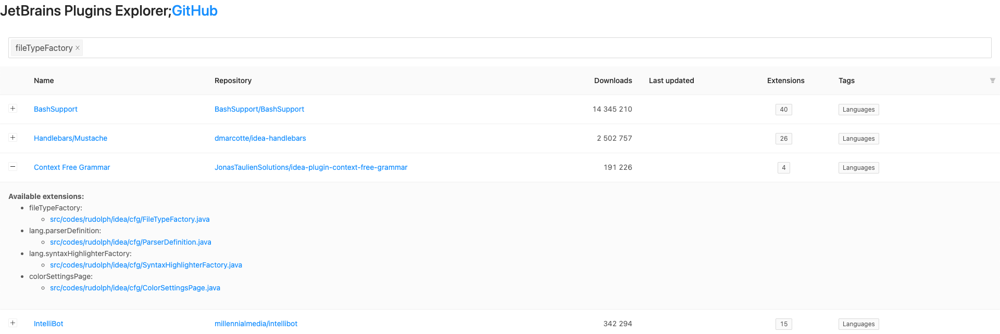

### History

This repository was a PoC project that was supposed to collect all the open-source, GitHub hosted projects of the plugins for the IntelliJ-based IDEs.
The first release was collecting the GitHub repositories' full list, download counters, and last update date.

The second version collected all the data within the JSON file and contained a simple web application hosted as a GitHub Pages.
Applications allowed displaying and browsing a list of plugins with additional information about the Extension Points that the plugin implements.
On the top, there was also a search input available to limit the list to the plugins that implement selected EPs.

The third version was a web application as well, entirely rewritten with the UI based on the JetBrains web components.
Unfortunately, these components are not publicly available, so it was impossible to build the application within the GitHub Actions.

# IntelliJ Platform Explorer

All these ideas contributed to the final tool - [IntelliJ Platform Explorer](https://plugins.jetbrains.com/intellij-platform-explorer).

**IntelliJ Platform Explorer** is a web tool integrated within the Marketplace platform.
It helps IntelliJ Platform plugin developers examine implementations of the Extension Points available in public GitHub repositories.

Check our [blog post](https://blog.jetbrains.com/platform/2020/12/intellij-platform-explorer-get-to-the-extension-point/) for more details.

Thanks!
Jakub
